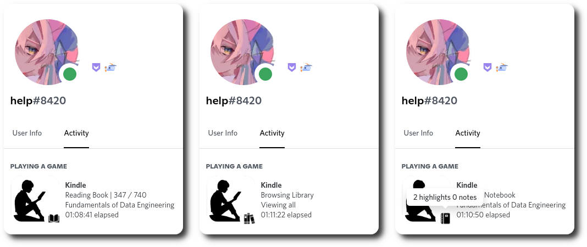
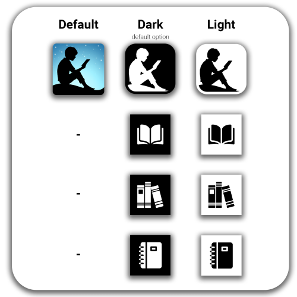

# Kindle Cloud Reader Discord Rich Presence

A chrome extension that enables rich presence for Kindle Cloud Reader

## Features

- Show your activity when you're reading, browsing library, and viewing notebooks



- Dark theme and light theme



## Installation

1. Download the chrome extension from [here](https://github.com/lazykern/kindle-cloud-reader-rpc/releases/latest/download/kindle-rpc-extension.zip)
2. Extract the zip file
3. Go to `chrome://extensions/`
4. Turn on `Developer mode`
5. Click `Load unpacked` and select the extracted folder (the folder that contains `manifest.json`)
6. Download the rich presence client in [releases page](https://github.com/lazykern/kindle-cloud-reader-rpc/releases/)
- For Windows, download `kindle-rpc.exe` or `kindle-rpc-console.exe` if you want it to show the console
- For Linux, download `kindle-rpc-linux` and run it with `./kindle-rpc-linux`
7. Run the rich presence client
8. Go to [Kindle Cloud Reader](https://read.amazon.com/) and enjoy!
- *Make sure that discord is running*
- *If the rich presence doesn't show up, try refreshing the page*

## Dependencies

- Extension
  - [plasmo](https://docs.plasmo.com/) (Framework)
  - node.js
  - pnpm or npm

- Client
  - Python 3.8+
  - pypresence


## Development

- Clone this repository

  ```bash
  git clone https://github.com/lazykern/kindle-cloud-reader-rpc.git
  cd kindle-cloud-reader-rpc
  ```

- Install dependencies for extension

  - using pnpm

    ```bash
    pnpm install
    ```

  - using npm

    ```bash
    npm install
    ```

- Build extension

  - Development

    ```bash
    pnpm dev
    ```

    or `npm run dev`

- Load the built extension inside `build/` into the browser

- Install dependencies for client

  ```bash
  python -m pip install pypresence
  ```

- Run client

  ```bash
  python client.py
  ```
